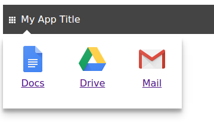

lizard-apps
===========

Lizard-apps is a simple, Google-apps like Django app for switching between web applications built on top of the `lizard-nxt <https://github.com/nens/lizard-nxt>`_ back end. An example of such an application is `lizard-client <https://github.com/nens/lizard-client>`_. A recognizable but contrived example:

Installation
------------

1. Add "lizard_apps" to your INSTALLED_APPS setting like this::

    INSTALLED_APPS = [
        ...
        'lizard_apps',
    ]

2. Include the lizard_apps URLconf in your project urls.py like this::

    url(r'^lizard_apps/', include('lizard_apps.urls')),

3. Add 'django.template.context_processors.media' in the 'context_processors' option of TEMPLATES, so {{ MEDIA_URL }} can be used in the `script.js <lizard_apps/templates/lizard_apps/script.js>`_ template.

4. Define MEDIA_ROOT and MEDIA_URL in your project's Django settings file. MEDIA_URL must end in a slash if set to a non-empty value as per docs; assumed is that it also starts with one.

5. Run `python manage.py migrate` to create the lizard-apps models.

6. Configure Applications and Screens (i.e. a collection of Appications) via the Django admin interface.

Usage
-----

A client at www.foo.com can use lizard-apps deployed at apps.lizard.net as follows::

    <!DOCTYPE html>
    <html lang="en">
      <head>
        <meta charset="utf-8">
        <title>title</title>
        <link rel="stylesheet" type="text/css" href="http://apps.lizard.net/static/lizard_apps/style.css">
        
      </head>
      <body>
        

      </body>
    </html>

The script tag loads a little plain-old javascript that inserts a switch button in the #lizard-apps-container; a default styling is provided via style.css but may be overriden.

TODO
----

- Better styling.
- Solve authentication issues.